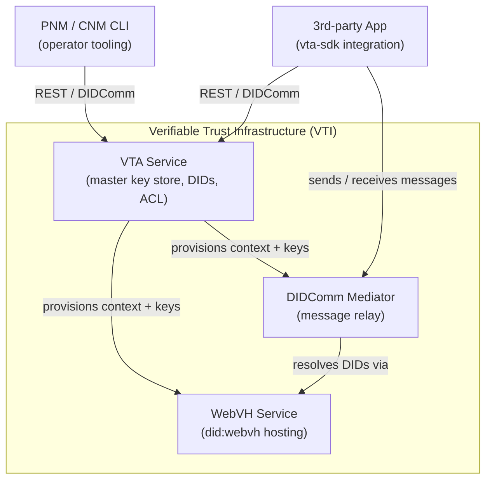

# VTI Setup

Setup guides for the **Verifiable Trust Infrastructure** stack — VTA, WebVH, and the DIDComm Mediator — and for the things people do on top of it.

The repo is organised by **who you are**, not by which service you're touching. Pick your role and follow the path.

---

## Pick your role

### [Developer](developer/)

You write code on top of OpenVTC. You'll use the OpenVTC CLI/TUI, you need a Personal VTA to hold your keys, and at some point you'll join a community.

→ [`developer/`](developer/) · stand up a Personal VTA, install the TUI, join your first community.

### [Community Manager](community-manager/)

You operate a VTC: bootstrap the community, set join and role policies, manage the ACL, review what automation can't decide.

→ [`community-manager/`](community-manager/) · bootstrap a VTC, ship policies, run the community.

### [Sysops](sysops/)

You run the VTI services so the other two can do their jobs. Provision the host, stand up VTA + Mediator + WebVH Daemon.

→ [`sysops/`](sysops/) · pick a deployment, then pick interactive or automated VTI setup.

---

## Components

| Component | Repo | Role |
| --- | --- | --- |
| **VTA** | [OpenVTC/verifiable-trust-infrastructure](https://github.com/OpenVTC/verifiable-trust-infrastructure) | Master key store — manages BIP-39 seed, DIDs, contexts, and ACL |
| **WebVH** | [affinidi/affinidi-webvh-service](https://github.com/affinidi/affinidi-webvh-service) | Hosts `did:webvh` DID documents publicly |
| **Mediator** | [affinidi/affinidi-tdk-rs · affinidi-messaging-mediator](https://github.com/affinidi/affinidi-tdk-rs/tree/main/crates/messaging/affinidi-messaging-mediator) | DIDComm v2 relay and message routing |

---

## Contributing

If you've followed a path and have notes, fixes, or a new tested combination to add, open a PR against the relevant persona folder. Stub pages (marked _Not yet written_) are tracked roadmap, not abandoned drafts — please fill one in if you've done the work.
