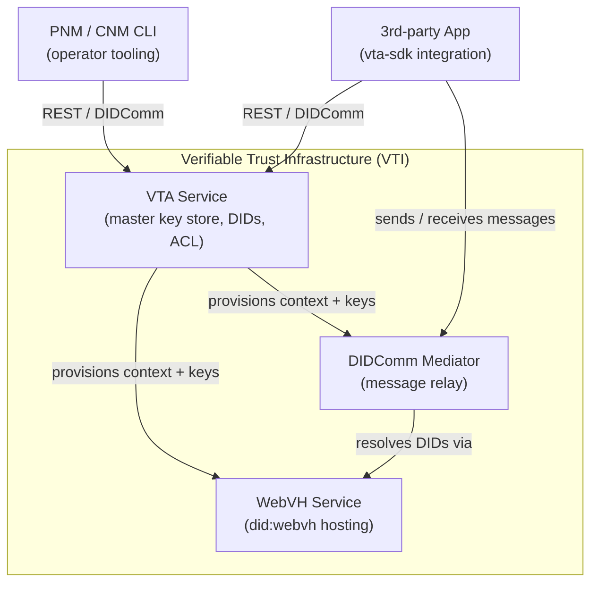
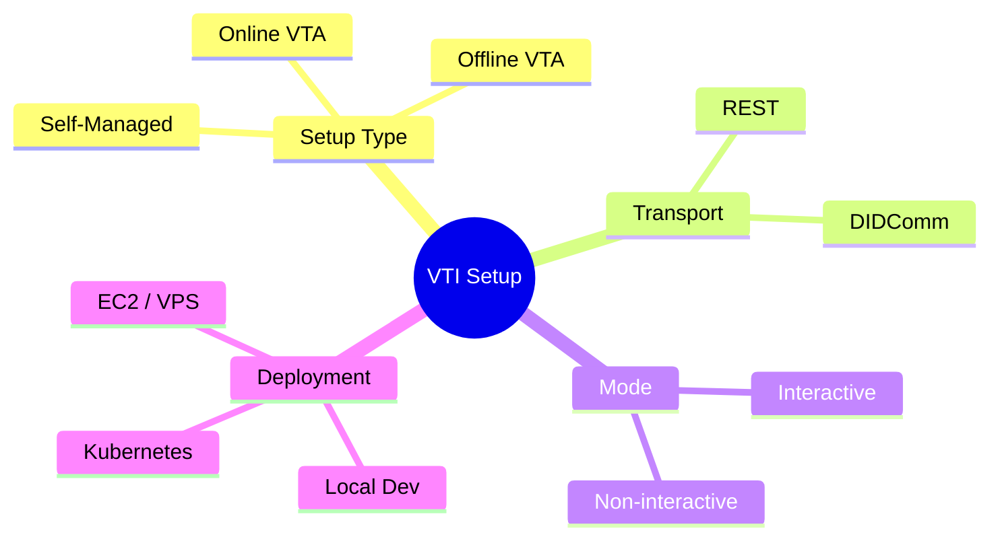
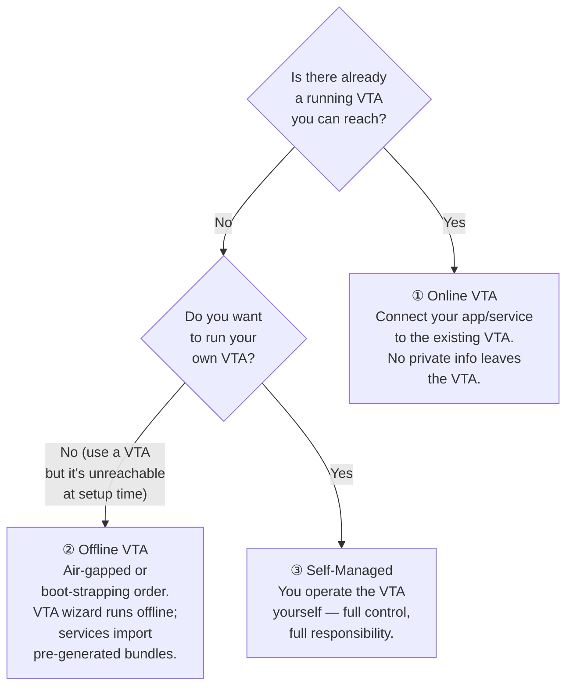
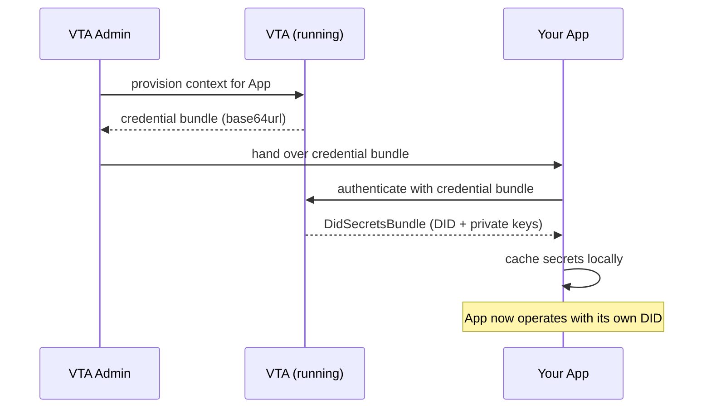
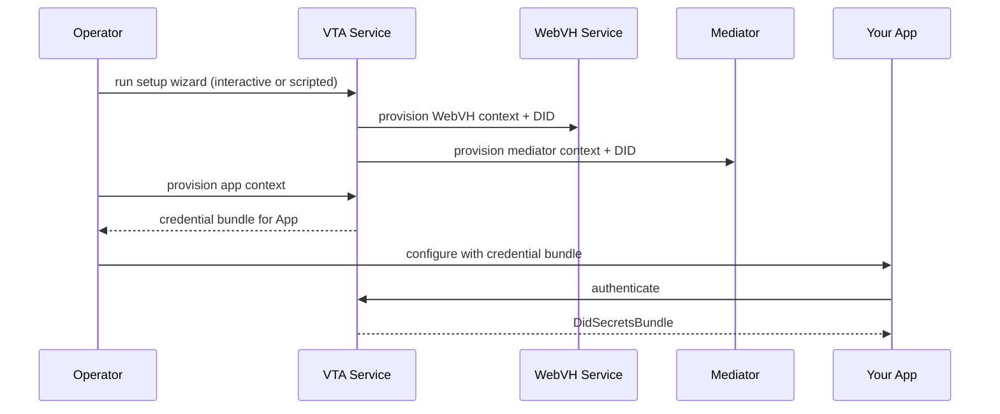
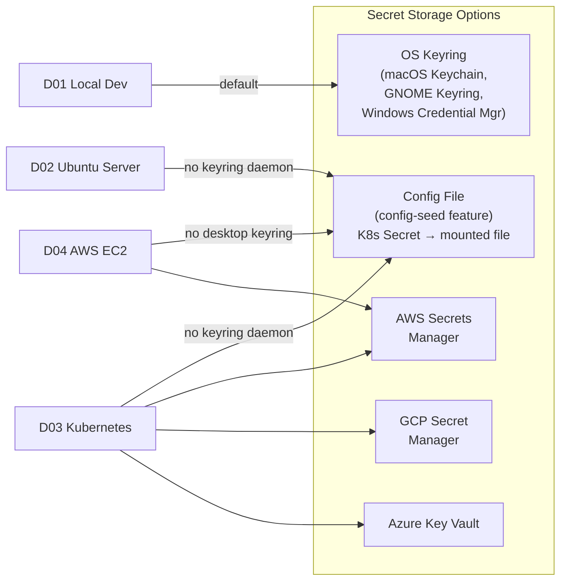

# VTI Setup Guide

An IC3-maintained collection of setup paths for the stack: VTA, WebVH, and the DIDComm Mediator.

- [Verifiable Trust Infrastructure](https://github.com/OpenVTC/verifiable-trust-infrastructure)
- [WebVH](https://github.com/affinidi/affinidi-webvh-service)
- [Mediator](https://github.com/affinidi/affinidi-tdk-rs/tree/main/crates/messaging/affinidi-messaging-mediator)

The goal is to document every realistic combination of setup type, transport, mode, and deployment environment so that anyone — from a first-time developer to an ops team deploying to production — can find a tested, reproducible path.

---

## Components



| Component | Repo | Role |
| --------- | ---- | ---- |
| **VTA** | [OpenVTC/verifiable-trust-infrastructure](https://github.com/OpenVTC/verifiable-trust-infrastructure) | Master key store — manages BIP-39 seed, DIDs, contexts, and ACL |
| **WebVH** | [affinidi/affinidi-webvh-service](https://github.com/affinidi/affinidi-webvh-service) | Hosts `did:webvh` DID documents publicly |
| **Mediator** | [affinidi/affinidi-tdk-rs · affinidi-messaging-mediator](https://github.com/affinidi/affinidi-tdk-rs/tree/main/crates/messaging/affinidi-messaging-mediator) | DIDComm v2 relay and message routing |

---

## The Four Dimensions

Every setup path is defined by four independent choices:



| # | Dimension | Options | Notes |
| - | --------- | ------- | ----- |
| 1 | **Setup Type** | Online VTA · Offline VTA · Self-Managed | How your service gets its keys and DID |
| 2 | **Transport** | REST · DIDComm | Protocol used to talk to the VTA |
| 3 | **Mode** | Interactive · Non-interactive | Human in the loop vs fully scripted |
| 4 | **Deployment** | Kubernetes · Local Dev · EC2/VPS | Runtime environment — affects keyring availability |

### Setup Type explained



---

## 12 Core Scenarios

The three setup types × two transports × two modes produce **12 scenarios**. The deployment environment is a cross-cutting concern documented separately (see [Deployment Environments](#deployment-environments)).

| | **REST** | **REST** | **DIDComm** | **DIDComm** |
| --- | :---: | :---: | :---: | :---: |
| | Interactive | Non-interactive | Interactive | Non-interactive |
| **Online VTA** | [S01](scenarios/S01-online-vta-rest-interactive.md) | [S02](scenarios/S02-online-vta-rest-noninteractive.md) | [S03](scenarios/S03-online-vta-didcomm-interactive.md) | [S04](scenarios/S04-online-vta-didcomm-noninteractive.md) |
| **Offline VTA** | [S05](scenarios/S05-offline-vta-rest-interactive.md) | [S06](scenarios/S06-offline-vta-rest-noninteractive.md) | [S07](scenarios/S07-offline-vta-didcomm-interactive.md) | [S08](scenarios/S08-offline-vta-didcomm-noninteractive.md) |
| **Self-Managed** | [S09](scenarios/S09-self-managed-rest-interactive.md) | [S10](scenarios/S10-self-managed-rest-noninteractive.md) | [S11](scenarios/S11-self-managed-didcomm-interactive.md) | [S12](scenarios/S12-self-managed-didcomm-noninteractive.md) |

### High-level flow per setup type

#### Online VTA



#### Offline VTA (boot-strap / air-gapped)

```mermaid
sequenceDiagram
    participant Wizard as VTA Setup Wizard
    participant VTA as VTA Service
    participant WebVH as WebVH Service
    participant MED as Mediator

    note over Wizard: Runs fully offline — no services up yet
    Wizard->>Wizard: generate BIP-39 seed
    Wizard->>Wizard: derive DIDs + key material
    Wizard->>Wizard: write config.toml + secrets bundles

    note over WebVH,MED: Services start and import pre-generated artifacts
    VTA->>WebVH: import-did (did:webvh log)
    MED->>MED: load-did / --import-bundle
    WebVH-->>VTA: DID hosted publicly

    note over VTA: VTA now reachable; normal Online VTA flow continues
```

#### Self-Managed



---

## Deployment Environments

The deployment environment is orthogonal to the 12 scenarios above — any scenario can run on any environment, but each environment has constraints that affect how secrets are stored.



| Environment | Keyring | Recommended seed storage | Notes |
| ----------- | :-----: | ------------------------ | ----- |
| [D01 Local Dev](deployments/D01-local-dev.md) | ✅ | `keyring` (default) | macOS Keychain / GNOME Keyring |
| [D02 Ubuntu Server](deployments/D02-ubuntu-server.md) | ❌ | `config-seed` | Headless Linux |
| [D03 Kubernetes](deployments/D03-kubernetes.md) | ❌ | `config-seed` | |
| [D04 AWS EC2](deployments/D04-AWS-ec2.md) | ⚠️ | `aws-secrets` | IAM role for Secrets Manager access |

---

## Repository Layout

```text
vti-setup/
├── README.md
├── scenarios/
│   ├── S01-online-vta-rest-interactive.md
│   ├── S02-online-vta-rest-noninteractive.md
│   ├── S03-online-vta-didcomm-interactive.md
│   ├── S04-online-vta-didcomm-noninteractive.md
│   ├── S05-offline-vta-rest-interactive.md
│   ├── S06-offline-vta-rest-noninteractive.md
│   ├── S07-offline-vta-didcomm-interactive.md
│   ├── S08-offline-vta-didcomm-noninteractive.md
│   ├── S09-self-managed-rest-interactive.md
│   ├── S10-self-managed-rest-noninteractive.md
│   ├── S11-self-managed-didcomm-interactive.md
│   └── S12-self-managed-didcomm-noninteractive.md
└── deployments/
    ├── D01-local-dev.md
    ├── D02-ubuntu-server.md
    ├── D03-kubernetes.md
    └── D04-AWS-ec2.md
```

---

## Contributing

Each scenario file follows a common template:

1. **Prerequisites** — what must be in place before you start
2. **Environment** — which deployment this was tested on
3. **Steps** — numbered, reproducible commands
4. **Verification** — how to confirm it worked
5. **Known issues** — edge cases encountered during testing

If you have tested a path, please open a PR filling in the corresponding scenario file and deployment notes.
