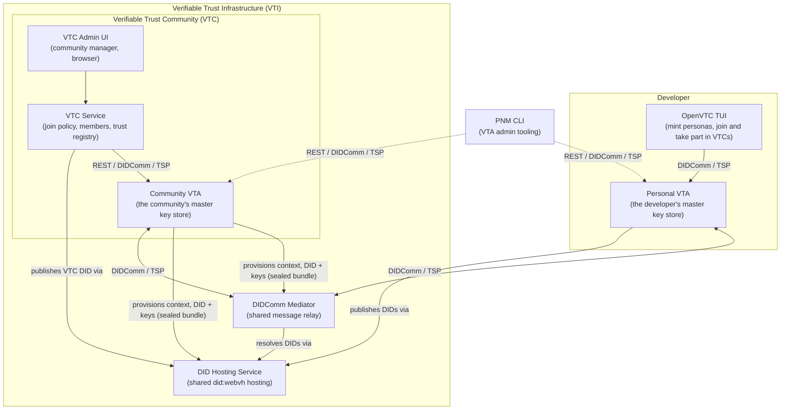

# VTI Setup

Setup guides for the **Verifiable Trust Infrastructure** stack — VTA, DID Host, and the DIDComm Mediator — and for the things people do on top of it.

The repo is organised by **who you are**, not by which service you're touching. Pick your role and follow the path.

---

## Pick your role

### [Developer](developer/)

You use OpenVTC to participate in one or more VTCs. You'll run a Personal VTA for your keys, drive it from the OpenVTC CLI/TUI, and join communities to present and collect credentials.

→ [`developer/`](developer/) · stand up a Personal VTA, install the TUI, join your first community

### [Community Manager](community-manager/)

You operate a VTC: bootstrap the community, set join and role policies, manage the ACL, review what automation can't decide.

→ [`community-manager/`](community-manager/) · bootstrap a VTC, ship policies, run the community

### [Sysop](sysop/)

You run the VTI services so the other two can do their jobs. Provision the host, stand up VTA + Mediator + DID Hosting Daemon.

→ [`sysop/`](sysop/) · **explore** the VTI end-to-end on a throwaway VM, or **deploy** a hardened VTA Farm on Kubernetes

---

## Components

```mermaid
graph TB
    subgraph DEV["Developer"]
        OVTC["OpenVTC TUI\n(mint personas, join and take part in VTCs)"]
        PVTA["Personal VTA\n(the developer's master key store)"]
    end

    subgraph VTI["Verifiable Trust Infrastructure (VTI)"]
        subgraph COMM["Verifiable Trust Community (VTC)"]
            ADMIN["VTC Admin UI\n(community manager, browser)"]
            VTC["VTC Service\n(join policy, members, trust registry)"]
            CVTA["Community VTA\n(the community's master key store)"]
        end
        MED["DIDComm Mediator\n(shared message relay)"]
        DIDHost["DID Hosting Service\n(shared did:webvh hosting)"]
    end

    PNM["PNM CLI\n(VTA admin tooling)"]

    OVTC -->|"DIDComm / TSP"| PVTA
    ADMIN --> VTC
    VTC -->|"REST / DIDComm / TSP"| CVTA
    PNM -.->|"REST / DIDComm / TSP"| PVTA
    PNM -.->|"REST / DIDComm / TSP"| CVTA
    CVTA -->|"provisions context, DID + keys (sealed bundle)"| MED
    CVTA -->|"provisions context, DID + keys (sealed bundle)"| DIDHost
    PVTA <-->|"DIDComm / TSP"| MED
    CVTA <-->|"DIDComm / TSP"| MED
    PVTA -->|"publishes DIDs via"| DIDHost
    VTC -->|"publishes VTC DID via"| DIDHost
    MED -->|"resolves DIDs via"| DIDHost
```

A developer runs a **Personal VTA** and drives it from **OpenVTC**. The community runs its own **Community VTA**, with the **VTC Service** on top of it and the **VTC Admin UI** as the community manager's way in. The two sides never talk directly: join requests, credentials, and approvals travel over the shared **Mediator**, and every DID involved is published through the shared **DID Host**. **PNM** administers either VTA. All three transports — REST, DIDComm v2, and TSP (Trust Spanning Protocol) — are enabled on the VTA, Mediator, DID Host, and VTC in the guides here; each client uses whichever the service advertises in its DID document.

| Component | Repo | Role |
| --- | --- | --- |
| **VTA** | [OpenVTC/verifiable-trust-infrastructure](https://github.com/OpenVTC/verifiable-trust-infrastructure) | Master key store — manages BIP-39 seed, DIDs, contexts, and ACL |
| **DID Host** | [affinidi/affinidi-webvh-service](https://github.com/affinidi/affinidi-webvh-service) | Hosts `did:webvh` DID documents publicly |
| **Mediator** | [affinidi/affinidi-tdk-rs · affinidi-messaging-mediator](https://github.com/affinidi/affinidi-tdk-rs/tree/main/crates/messaging/affinidi-messaging-mediator) | DIDComm v2 relay and message routing |
| **VTC** | [OpenVTC/verifiable-trust-infrastructure](https://github.com/OpenVTC/verifiable-trust-infrastructure) | Community service — join policy, members, trust registry, and the VTC Admin UI for community managers |
| **OpenVTC** | [OpenVTC/openvtc](https://github.com/OpenVTC/openvtc) | Developer TUI for driving a Personal VTA — mint personas, join and participate in VTCs |
| **VTA Farm** | [ic3software/vtafarm-k8s](https://github.com/ic3software/vtafarm-k8s) · [vtafarm-api](https://github.com/ic3software/vtafarm-api) · [vtafarm](https://github.com/ic3software/vtafarm) | Hardened multi-tenant Kubernetes platform that hosts VTAs, with master seeds held in HashiCorp Vault |

---

## Contributing

If you've followed a path and have notes, fixes, or a new tested combination to add, open a PR against the relevant persona folder. Stub pages (marked _Not yet written_) are tracked roadmap, not abandoned drafts — please fill one in if you've done the work.
